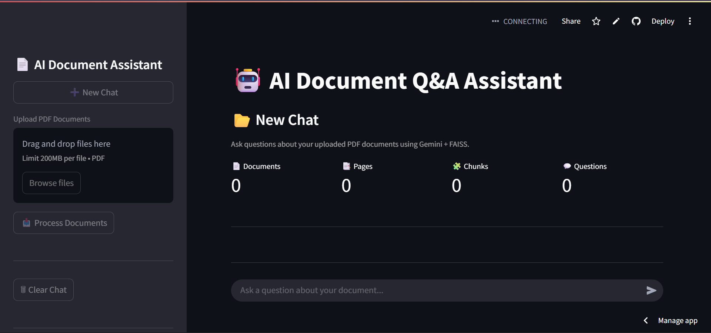
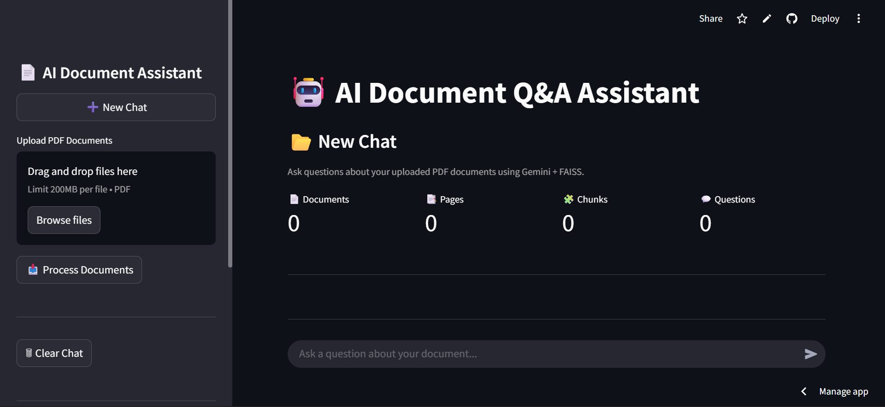
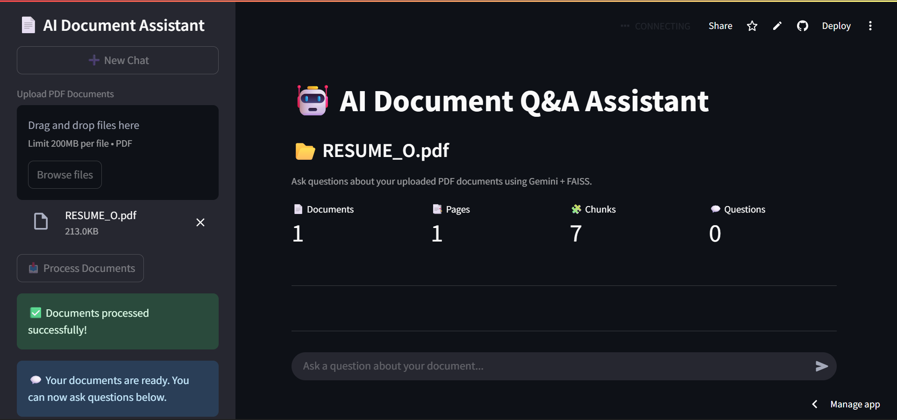
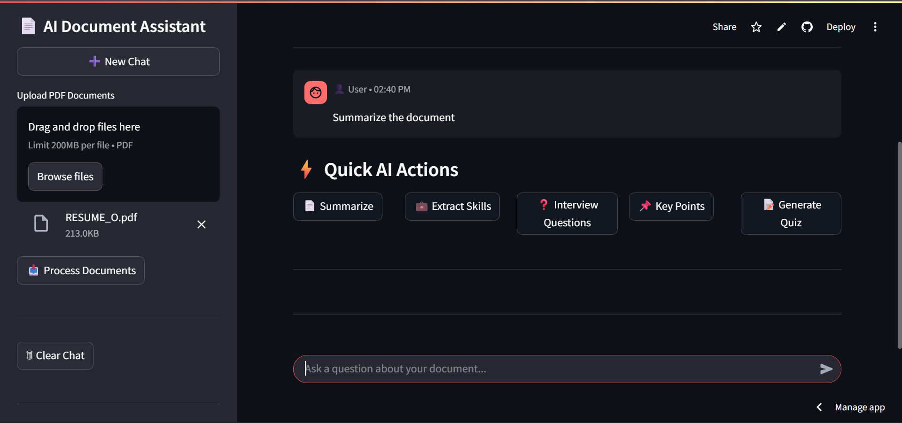
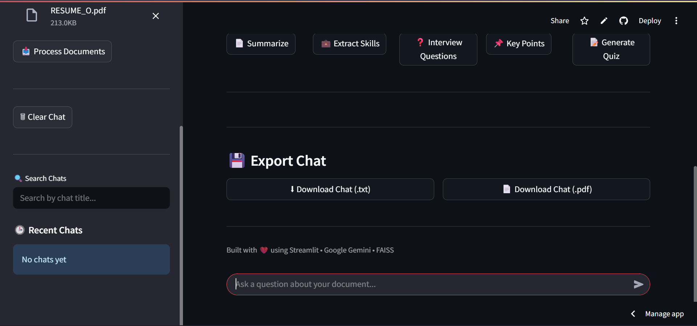
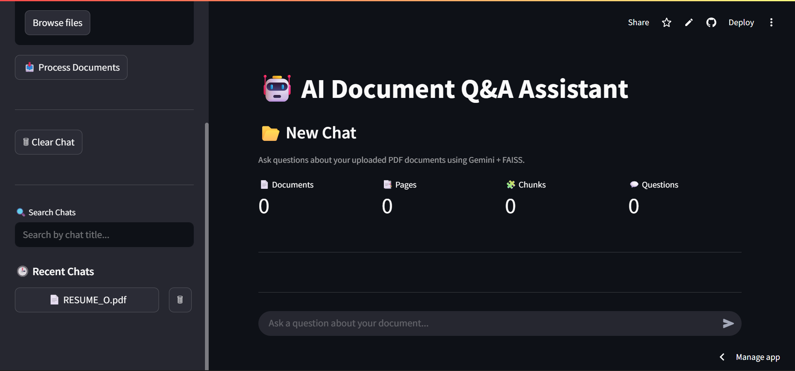

# 🤖 AI Document Q&A Assistant

An AI-powered Document Question Answering application that enables users to upload PDF documents and ask questions in natural language. The application leverages **Retrieval-Augmented Generation (RAG)** with **Google Gemini**, **LangChain**, and **FAISS** to provide accurate, context-aware answers based on the uploaded documents.

---

## 🚀 Live Demo

🌐 **Live Application:**  
https://ai-document-app-assistant-2mry2pqbf9jmnzvfzudnjy.streamlit.app

💻 **GitHub Repository:**  
https://github.com/codeWithKiru/AI-Document-QA-Assistant

---

## 📌 Project Overview

This application simplifies document analysis by allowing users to interact with PDF documents through an AI-powered chat interface. Instead of manually searching through lengthy documents, users can ask questions, generate summaries, extract key insights, and receive intelligent responses grounded in the document content.

---

## ✨ Features

| Feature | Description |
|---------|-------------|
| 📄 PDF Upload | Upload one or multiple PDF documents |
| 🤖 AI Chat | Ask questions about uploaded documents |
| 🔍 RAG Pipeline | Retrieves relevant document context before generating answers |
| 🧠 Semantic Search | Uses FAISS for efficient vector similarity search |
| 💡 Suggested Questions | Generates intelligent follow-up questions |
| ⚡ Quick AI Actions | Summarize, Quiz, Skills, Interview Questions & Key Points |
| 📊 Document Insights | Provides AI-generated document analysis |
| 💬 Chat History | Maintains conversation history |
| 📥 Export Chat | Download chat as TXT or PDF |
| 🔄 CI/CD | Automated workflow using GitHub Actions |

---

## 🛠️ Tech Stack

| Category | Technologies |
|----------|--------------|
| Frontend | Streamlit |
| Backend | Python |
| AI Model | Google Gemini |
| Framework | LangChain |
| Vector Database | FAISS |
| PDF Processing | PyPDF |
| Utilities | ReportLab, python-dotenv |
| Version Control | Git & GitHub |
| Deployment | Streamlit Community Cloud |
| Automation | GitHub Actions |

---

## 🏗️ Workflow

```text
PDF Upload
      │
      ▼
Text Extraction
      │
      ▼
Text Chunking
      │
      ▼
Embedding Generation
      │
      ▼
FAISS Vector Store
      │
User Question
      │
      ▼
Similarity Search
      │
      ▼
Relevant Context
      │
      ▼
Google Gemini
      │
      ▼
AI Response
```

---

## 📸 Screenshots

### Home Page


### Dashboard


### Document Uploaded


### Quick AI Actions


### Export Chat


### Recent Chat History


---

## 📂 Project Structure

```text
AI-Document-QA-Assistant/
│── .github/
│── screenshots/
│── app.py
│── gemini_service.py
│── rag.py
│── pdf_reader.py
│── text_splitter.py
│── suggestions.py
│── insights.py
│── requirements.txt
│── README.md
```

---

## ⚙️ Installation

```bash
git clone https://github.com/codeWithKiru/AI-Document-QA-Assistant.git

cd AI-Document-QA-Assistant

pip install -r requirements.txt
```

Create a `.env` file:

```env
GOOGLE_API_KEY=YOUR_GEMINI_API_KEY
```

Run the application:

```bash
streamlit run app.py
```

---

## 🚀 Future Enhancements

- OCR support for scanned PDFs
- Support for DOCX and PPTX files
- User authentication
- Multi-language document support
- Conversation memory
- Cloud-based vector database integration

---

## 👩‍💻 Author

**Kiruthika M E**

- **GitHub:** https://github.com/codeWithKiru
- **LinkedIn:** https://www.linkedin.com/in/kiruthika-m-e-83a521276

---

## ⭐ Support

If you found this project useful, consider giving it a **⭐ Star** on GitHub. Your support and feedback are always appreciated!
